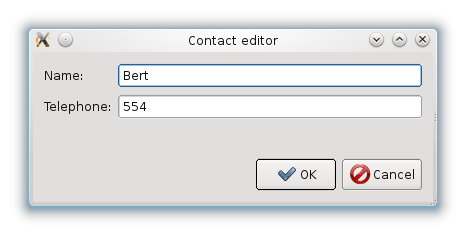
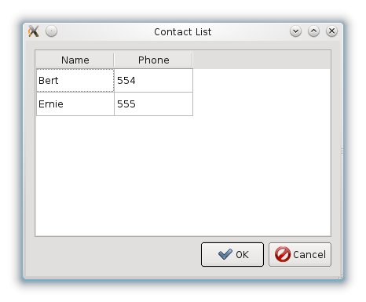

===========
Qonda guide
===========


Version 0.8.0, 2016-09-16


.. contents::


Intro
=====

Qt includes since version 4 support for a model/view architecture,
dubbed the Interview framework, and PyQt exposes said functionality.
Yet, using it directly could be burdensome, specially in applications
whose data models involve a large number of entity classes, as such
classes should either inherit from the ``QAbstractItemModel`` class and
reimplement its abstract methods, or build adapters that
wraps the model into ``QAbstractItemModel``-derived objects.

Qonda relieves this works providing generic adapter classes for
Python models, along a number of enhancements over the Qt classes
in order to make use of Interview easier in Python, yet preserving
most of its raw power.

Requisites
==========

A basic knowledge of Python and PyQt programming are required to follow
this tutorial. If you are able to build a widget based UI with PyQt and
make it work you are ready to go!

Qonda currently supports Python 2.7 and 3.x. Qonda sources are 2.7, but
mostly used in 3.4 so version specific bugs can exists if you use it in 2.7.
For use with Python 3.x, sources are translated using 2to3 at install time
(plus some manual adjustment).

Also Qonda supports both PyQt4 and PyQt5. PyQt4 is the default. See
`PyQt5 support`_ for details.

This guide assumes use of Python 2.7 and PyQt4, but few (if any) changes are
required between versions, the main difference being unicode strings becoming
the standard string type en Python 3.

Interview overview
==================

All models in Interview inherit from ``QAbstractItemModel``, with a
structure of a tree of nested tables, adequate to represent tables,
trees and lists.

Items in the model are usually referenced using ``QModelIndex`` objects.
Indexes have the row and column of the item in its containing table,
and the index of the parent item of that table, with an "invalid index"
used to represent the parent of the top level table.

While most of the time you do a light use of this concepts while using
Qonda, sometimes you have to deal with them.

Models are then used in views. Views in traditional Qt are either widgets
like tables (``QTableView``) and trees (``QTreeView``), or sets of widgets like
edits and combos that become part of a view using a ``QDataWidgetMapper``
object.

First steps
===========

Please note these aren't complete, runnable examples. Separate
example source files are provided along this document. Also, this examples
are meant to be as simple and understandable as possible, enhancements in
code and presentation are of course possible either using PyQt or Qonda
features.

Let's start with a simple model for a contact list::

    class Contact(object):

        def __init__(self, name=None, phone=None):
            self.name = name
            self.phone = phone

And the matching UI definition using Qt Designer:



Then, we can build a form to show and edit contacts::

    from PyQt4.QtGui import QWidget
    from qonda.mvc.adapters import ObjectAdapter
    from qonda.mvc.datawidgetmapper import DataWidgetMapper

    ...

    class ContactEditor(QWidget):

        def __init__(self):
            super(QWidget, self).__init__()
            from editor_ui import Ui_Form
            self.ui = Ui_Form()
            self.ui.setupUi(self)

            self.model = Contact("Bert", 554)

            adapter = ObjectAdapter(
                ('name', 'phone'),
                self.model)

            mapper = DataWidgetMapper()
            mapper.addMappings(
                self.ui.name,
                self.ui.phone)

            mapper.setModel(adapter)


In this example, after the standard PyQt boilerplate, a new contact
model is created in the editor window, and the attribute values should be
properly shown in the editor fields.

Also, an ``ObjectAdapter`` is created. ``ObjectAdapter`` is part of the core
Qonda functionality, presenting the attributes of a Python object as a Qt
Interview model suitable to be used in a Qt view::

    adapter = ObjectAdapter(
        ('name', 'phone'),
        model)

The first argument is the list of attributes that will be presented as part
of the Interview Model. The second argument is the model itself. Additional
arguments will be used in further chapters of this tutorial, and also could
be found in the reference.

Attributes can hold simple values like unicode strings or integers, or any
object, if no formatter is provided the adapter will use unicode() to get
a proper value.

As a special case, and empty string in the attribute list can be used to refer
to the model itself [#]_.

.. [#] This can be useful if the object has a ``__unicode__`` or ``__str__``
       method, but also if bending the rules you want to use a formatter
       to present a result calculated from the model state. The recommended
       approach in this case, nevertheless, is to define a new property in the
       model class with ``@property``.

Adapters support composition too. So, you could also do the following and the
adapter will do the right thing::

    adapter = ObjectAdapter(
        (
            'name',
            'city',
            'city.province'),
        model)


In order to build a view from independent widgets, Qt provides the
``QDataWidgetMapper`` class. ``QDataWidgetMapper`` has the ``addMapping()``
method, that maps a widget to a column of the Interview model.
Qonda has an improved version, ``qonda.mvc.datawidgetmapper.DataWidgetMapper``.
The example uses ``DataWidgetMapper`` and its ``addMappings()`` method,
less verbose than using regular ``QDataWidgetMapper``'s
``addMapping()`` method.

Finally, ``mapper.setModel()`` connects the model to the view.

Changes made in the fields propagate automatically to the model.
The inverse, changes in the model propagating to the view also can be achieved,
but are described later in this tutorial.

List of entities and tables
===========================

Working with a list of entities and a ``QTableView`` is somewhat easier.



The example code for this case is::

    from PyQt4.QtGui import QWidget
    from qonda.mvc.adapters import ObjectListAdapter

    ...

    class ContactList(QWidget):

        def __init__(self):
            super(QWidget, self).__init__()
            from contactlist_ui import Ui_Form
            self.ui = Ui_Form()
            self.ui.setupUi(self)

            self.model = [
                Contact("Bert", 554),
                Contact("Ernie", 555)
            ]

            adapter = ObjectListAdapter(
                ('name', 'phone'),
                self.model)

            self.ui.contacts.setModel(adapter)


The adapter in this case is an ``ObjectListAdapter``, that adapts a list of
entities of the same class::

    adapter = ObjectListAdapter(
        ('name', 'phone'),
        self.model)

Of course, you also could use ``ObjectListAdapter`` with ``DataWidgetMapper``,
showing an entity at once (check ``QDataWidgetMapper`` documentation for
details), or ``ObjectAdapter`` with a ``QTableView``, although silly as
``ObjectAdapter`` is a one row model.

Observable models
=================

Both examples have a limitation: As soon as you modify your Python model,
you'll find your view won't get updated. In order to have model changes
automatically updated, you either need to make your model observable,
or use proxy objects.

To make your model observable, you need to make your class inherit from
``Observable``. You usually will use ``ObservableObject``, that emits update
events when you set your object attributes::

    from qonda.mvc.observable import ObservableObject


    class Contact(ObservableObject):

        def __init__(self, name=None, phone=None):
            ObservableObject.__init__(self)
            self.name = name
            self.phone = phone


By default, update events happen when any public attribute (not starting
with underscore) is set. If you want to restrict events to a subset of
attributes, use the ``_notifiables_`` class attribute::

    class Contact(ObservableObject):

        _notifiables_ = ('name', 'phone')

        def __init__(self, name=None, phone=None, city=None):
            ObservableObject.__init__(self)
            self.name = name
            self.phone = phone
            self.city = city  # Changes in this attribute won't trigger events

Note that if you override ``__init__`` like in the example, **you must** call
the superclass ``__init__()``.

If you need to use ObservableObject along with other parent class, please
note that ``__init__()`` in Observable objects don't call ``super()``, hence you
will need to write your own ``__init__()`` method and call either ``__init__()``
individually there.

Also, Observable (and hence ObservableObject) has support for objects persisted
using SQLAlchemy implementing a *reconstructor* method. Therefore Observable
descendants implementing a reconstructor must call ``super().reconstructor()``.

Adapters observe observable objects automatically, no further action is
required.

.. note:: When a ``x`` attribute of an ObservableObject instance is set to
    an ObservableObject instance, the first instance will observe the second
    instance automatically, and a ``y`` attribute update in the second instance
    will be seen by observers of the first one as updates of the ``x.y``
    attribute.

    While this is usually convenient, in large models this could cause
    innecessary overhead, specially if objects relate to each other.
    In those cases you should consider using ``_notifiables_``, to limit
    events retransmission.


Observable proxies
------------------

As an alternative, if you don't want to have your model coupled with Qonda,
you can use ``ObservableProxy``::

    from qonda.mvc.observable import ObservableProxy

    ...
    self.model = ObservableProxy(model)
    adapter = ObjectAdapter(
        ('name', 'phone'),
        self.model)
    self.mapper.setModel(adapter)


Of course, the catch is that any further changes to the model should be done
through the proxy in order to get the views updated. Eventually you could wrap
any method of the model that updates the attributes in order to emit the update
event after the change.

Observable lists
----------------

Observable lists are always implemented as proxies, but the target argument
is optional.::

    from qonda.mvc.observable import ObservableListProxy

    ...
    self.model = ObservableListProxy(contacts)
    adapter = ObjectListAdapter(
        ('name', 'phone'),
        self.model)
    self.mapper.setModel(adapter)

If you don't provide a target, a new empty list is used, and could be used
as a regular list::

    self.model = ObservableListProxy()
    self.model.append(Contact("Bert", 554))

Observable lists track list operations like insertions or removals, but they
don't observe changes on its items, to do so those must be observable (and
observed) as well.

Emitting arbitrary events
-------------------------

You can use the observable/observer infrastructure for your own purposes too.
For this, besides inheriting from one of the observable classes
(``Observable``, ``ObservableObject``, ``ObservableProxy`` and
``ObservableListProxy``), you must use the ``Observable._notify`` method with
the event type and any event related data you want to pass to your observers::

    class MyObservableObject(Observable):
    ...
        def my_event(self):
            ...
            my_event_related_data = 42
            self._notify("my_event_type", my_event_related_data)

Writing observers
-----------------

Any callable can be an observer, so you can either use methods, standalone
functions, or any other callable object.

The prototype for an observer is::

    observer_function(sender, event_type, observer_data, event_data)

Where sender is the object emitting the event, event_type is the event type
from the ``_notify()`` method, observer_data is extra data provided when
setting the observer,
and event_data is the data from the ``_notify()`` method.

Observing events
----------------

In order to observe events, you must call the ``add_callback()`` method of
the observable object::

    observer_data = 123
    model.add_callback(my_callback, observer_data)

Where observer_data is any additional data required by the observer to
process the event.

Any number of observers can observe an object, and an observer can observe
any number of objects. There is no warranty on the order of callback
invocation.

You also can stop observing an object::

    model.remove_callback(my_callback)

ObservableObject events
-----------------------

Currently, ``ObservableObject``  and ``ObservableProxy`` emit the following
events:

* before_update: Immediately before assigning a new value to an attribute.
  event_data is a tuple of length 1 containing the attribute name.
* update: Immediately after assigning a new value to an attribute.
  event_data is a tuple of length 1 containing the attribute name.

Hence, an observer for an ObservableObject could be::

    def observer(sender, event_type, _, attributes):
        if event_type == "update":
            if "price" in attributes:
                sender.tax = sender.price * TAX_RATE
                sender.total = sender.price + sender.tax

While ``attributes`` is a tuple of length 1 as a generalization.
Your observers should be written, as best practice, for an arbitrary number
of attributes,  and use ``for`` and ``in``, so they will work correctly if
you use them with other Observable objects that could emit events with
several attributes at once.

ObservableListProxy events
--------------------------

``ObservableListProxy`` objects emit the following events:

* before_setitem: Before doing ``l[i] = x or l[i:j] = new_items``.
  Event data: index (or slice), and new value length.
* setitem: After doing ``l[i] = x or l[i:j] = new_items``.
  Event data: index (or slice), and new value length.
* before_delitem: Before doing ``del l[i]``, ``l.remove(x)`` or ``l.pop()``.
  Event data: index.
* delitem: After doing ``del l[i]``, ``l.remove(x)`` or ``l.pop()``.
  Event data: index.
* before_insert: Before doing ``l.insert(i, x)``.
  Event data: index.
* insert: After doing ``l.insert(i, x)``.
  Event data: index.
* before_append: Before doing ``l.append(x)``.
  Event data: None.
* append: After doing ``l.append(x)``.
  Event data: None.
* before_extend: Before doing ``l.extend(items)``.
  Event data: len(items).
* extend: After doing ``l.extend(items)``.
  Event data: len(items).

Qonda and metadata
==================

There are several customizations in the handling of the model available,
those are done using model metadata. Most metadata properties are related
to Qt Interview roles.

You can set metadata:

* In the model class.
* In the adapter.

Class level Metadata
--------------------

You can add metadata to your model classes, using the ``_qonda_column_meta_``
class. Those are dicts, with keys being the name of the attributes the
metadata is being defined, and values are dicts of attribute specific
metadata::

    class Contact(ObservableObject):

        _qonda_column_meta_ = {
            'name': {
                'title': "Full Name",
                'width': 30
                }
            }

        def __init__(self, name=None, phone=None):
            ObservableObject.__init__(self)
            self.name = name
            self.phone = phone

.. tip:: Alternatively lack of coupling can be preserved assigning
    `` _qonda_column_meta_`` outside the class definition::

	    Contact._qonda_column_meta_ = {
		'name': {
		    'width': 30
		    }
		}

Using class level metadata only works when the class argument is set in the
adapter constructor. See next section for details.

Also, instead of a dict you can use the type (class) of an attribute.
In that case, the special key '.' in the attribute class metadata is used
for such attribute.::

    class Contact(ObservableObject):

        _qonda_column_meta_ = {
            '.': {  # Metadata for this class when used as a value
                'width': 30
            },
            'name': {
                'title': "Full Name",
                'width': 30
                }
            }

    class Call(ObservableObject):

        _qonda_column_meta_ = {
            'contact': Contact  # Use metadata from '.' key from Contact
            }

If you plan to use composited attributes in your adapters (like 'contact.phone',
make sure to use types as metadata, this way Qonda will be able to find the
proper metadata following the chain of metadata definitions.

Besides the special '.' key, you can define the special '*' key, in order to
set metadata properties affecting the presentation of all the attributes,
(e.g. a full row in a view), without repeating them for
each attribute::

    class Contact(ObservableObject):

        _qonda_column_meta_ = {
            },
            '*' {
		# Common metadata for all attributes of this class instances
                'foreground': QColor("blue")  # All attributes displayed in blue
                                              # unless foreground is set in
                                              # an attribute key
            },
            'name': {
                'title': "Full Name",
                'width': 30,
		'foreground': QColor("white")  # This overrides the blue foreground
                }
            }


Adapter level metadata
----------------------

You can add or override metadata in each adapter, setting the desired property
as a tuple containing the attribute name and the dict metadata::

        adapter = ObjectListAdapter(
            (
                ('name', {
                    'width': 30
                }),
                'phone'
            ),
            self.model)

For compatibility with older releases, Qonda also accepts the deprecated
``column_meta`` argument. The argument is a tuple of dicts, one as many columns
have the adapter::

        adapter = ObjectListAdapter(
            ('name', 'phone'),
            self.model, column_meta=
            (
                {'width': 30},
                {}
            ))

If class metadata is also available, adapter uses both. Individual
metadata properties set in the adapter override properties in class
metadata when both are set.

Metadata properties
-------------------

The next metadata properties are available, column wise:

==================  ======================  ==========================  =============  ========================================
Property            Property type           Value type                  Qt Role        Description
==================  ======================  ==========================  =============  ========================================
title               Constant                unicode                     DisplayRole    Column title in QTableView and QTreeView
width               Constant                int                         SizeHintRole   Column width in characters. Used in
                                                                                       table and tree views along
                                                                                       ``resizeColumnsToContents()``
columnResizeMode    Constant                ``QHeaderView.ResizeMode``                 ResizeMode for the column (Qonda
                                                                                       extension, works with Qonda's TableView
                                                                                       and TreeView widgets).
                                                                                       Usually set to ``QHeaderView.Stretch``
                                                                                       (use any extra available space) or
                                                                                       ``QHeaderView.ResizeToContents`` (use
                                                                                       available space according to contents)
==================  ======================  ==========================  =============  ========================================

The next metadata properties are available, attribute value wise:

================== ====================== ======================== ============== ============================================
Property           Property type          Value type               Qt Role        Description
================== ====================== ======================== ============== ============================================
displayFormatter   Callable               unicode                  DisplayRole    A callable that receives the attribute value
                                                                                  and returns the formatted for displaying in
                                                                                  a view.
editFormatter      Callable               unicode                  EditRole       A callable that receives the attribute value
                                                                                  and returns the formatted for displaying in
                                                                                  editors.
decoration         Callable or constant   ``QIcon``, ``QColor``    DecorationRole Icon for the attribute. If it's a callable
                                          or ``QPixmap``                          it receives the entity as argument.
tooltip            Callable or constant   unicode                  ToolTipRole    Tooltip for the attribute. If it's a callable
                                                                                  it receives the entity as argument.
statustip          Callable or constant   unicode                  StatusTipRole  Statustip for the attribute. If it's a
                                                                                  callable it receives the entity as argument.
whatsthis          Callable or constant   unicode                  WhatsThisRole  What's this help text for the attribute. If
                                                                                  it's a callable it receives the entity as
                                                                                  argument.
font               Callable or constant   ``QFont``                FontRole       Font family/size/style/weight used to show
                                                                                  the value. If it's a callable it receives
                                                                                  the entity as argument.
alignment          Constant               ``Qt.Alignment``         AlignmentRole  Field alignment.
background         Callable or constant   ``QBrush`` or ``QColor`` BackgroundRole Color/brush used to paint the background of
                                                                                  the widget or field. If it's a callable it
                                                                                  receives the entity as argument.
foreground         Callable or constant   ``QBrush`` or ``QColor`` ForegroundRole Color/brush used to paint the value on the
                                                                                  widget or field. If it's a callable it
                                                                                  receives the entity as argument.
mime               Callable                object                                 A callable returning data representing the
                                                                                  item in order to be serialized in a
                                                                                  call to mimeData(). See Drag 'n Drop support.
flags              dict, keys are
                   ``Qt.ItemFlags``,      bool                                    Flags of the Interview model item, such as
                   values are callables                                           the item being enabled, editable or
                   or constants                                                   selectable.
================== ====================== ======================== ============== ============================================

Also, at the adapter level can be defined the ``alias`` property, used to
distinguish between two adapter columns when refering to the same model
attribute, when mapping columns to widgets. See
``DataWidgetMapper.mapFromPropertyList()`` for details.

Adapters, in detail
===================

The full syntax for ``ObjectAdapter`` creation is::

    ObjectAdapter(properties, model=None, class_=None,
            column_meta=None, row_meta=None, parent=None)

* properties: A list (but usually a Python tuple) of either attribute names, or
  tuples containing each attribute name along a dict with adapter level metadata.
* model: The model entity object
* class\_: The class of the model, for metadata purposes, as model eventually could be None. See also ``ObjectListAdapter``.
* column_meta: The adapter level metadata, a list or tuple of dict **(DEPRECATED)**.
* row_meta: Adapter level row wide metadata, a dict.
* parent: As adapters are QObject inheritors, can have parents for memory management purposes. Usually not used.

The syntax for ``ObjectListAdapter`` is similar::

    ObjectListAdapter(properties, model=None, class_=None, column_meta=None,
        row_meta=None, parent=None, options=None, item_factory=None)

* class\_: For metadata purposes, but also for row appending. See also ``item_factory``.
* options: A set of options, by default assumes {'edit', 'append'}:
    + edit: Allow item editing (currently not used, see flags)
    + append: Allows visual appending by showing a fake row at the bottom of the model. (Currently used only in empty models)
* item_factory: Callable that return a new entity to be inserted into the model when ``insertRows()`` is called from the Qt side. If not set, ``class_`` constructor is used.

Adapter API
-----------

Adapters inherits from ``QAbstractItemModel``, and as such implements all
of its methods and properties. Also implements the next methods.

* ``getPyModel()``: Returns the Python model of the adapter.::

    # What's the current model for this adapter?
    model = self.adapter.getPyModel()
    model.foo = 5

* ``setPyModel(model)``: Changes the underlying Python model of the adapter.::

    # Need to completely replace the model for a new one
    self.adapter.setPyModel(model)


* ``getPyObject(index)``: Returns the entity matching the given ``QModelIndex``.
    In ObjectAdapter returns the model for any index, in ObjectListAdapter
    returns the row of the list for the matching row of the index, and
    so on.::

        # See also datawidgetmapper.DataWidgetMapper.currentPyObject(),
        # widgets.views TableView.currentPyObject(),
        # and widgets.views TreeView.currentPyObject()
        current_contact = self.adapter.getPyObject(self.ui.contacts.currentIndex())

* ``getPropertyColumn(propertyname)``: Returns the column number of the given
    property.::

        # Hide the column for phone without having the column number at hand
        column = self.adapter.getPropertyColumn('phone')
        self.ui.contact.setColumnHidden(column, True)

* ``getColumnProperty(col)``: Returns the property name of the given column.

* ``properties()``: Returns the property list

* ``propertyAliases()``: Returns the list of property aliases. A property alias
    is the value of the 'alias' if it's defined, of the property name if it
    isn't. This is useful with DataWidgetMapper.mapFromPropertyList()
    (see below).

Other adapters
--------------

``ValueListAdapter`` wraps a list of objects to be interpreted as values,
implementing a single column Interview model where each item matches one
value::

    ValueListAdapter(model, parent=None, class_=None,
        column_meta=None, row_meta=None)

Note that no property argument is required, however ``column_meta`` is
still a sequence, in order to be consistent with other adapters.

Common use of ``ValueListAdapter`` is as the model for combo boxes::

    choices = ["Apple", "Orange", "Banana"]  # Any kind of object allowed
    self.choices_adapter = ValueListAdapter(choices)
    self.ui.comboBox.setModel(self.choices_adapter)

``ObjectTreeAdapter`` is a more powerful version of ``ObjectListAdapter``,
able to wrap a tree-like structure of objects of the same type::

    ObjectTreeAdapter(properties, model=None, class_=None,
            column_meta=None, row_meta=None, qparent=None,
            rootless=False, options=None, parent_attr='parent',
            children_attr='children'):

* qparent: Same as parent in previous cases.
* rootless: If ``False``, the model tree have a root object. If ``True``, the provided model is a list with no common root.
* parent_attr: Name of the model's attribute that reference each item parent
* children_attr: Name of the model's attribute that references each item children.


Mappers, widgets and delegates
==============================

Delegates
---------

Delegates are objects that copy values from the model to the view, and vice
versa. When used in views like ``QTableView``, also build alternate editors
and draw values in the view.

Qonda provides several custom delegates, in order to use alternative editor
in views, and being able to customize the editor properties:

* ComboBoxDelegate: Use QComboBox in views::

    mvc.delegates.ComboBoxDelegate(parent=None, model=None, **properties)

* SpinBoxDelegate: Use QSpinBox in views::

    mvc.delegates.SpinBoxDelegate(parent=None, **properties)

* DateEditDelegate: Use QDateEdit in views::

    mvc.delegates.DateEditDelegate(parent=None, **properties)

* LineEditDelegate: Use QLineEdit with alignment, inputMask, etc.::

    mvc.delegates.LineEditDelegate(parent=None, validator=None, **properties):

* CheckBoxDelegate: Use QCheckBox in views.::

    mvc.delegates.CheckBoxDelegate(parent=None, **properties)

* LookupWidgetDelegate: Use LookupWidgetDelegate in views.::

    widgets.LookupWidgetDelegate(parent=None, search_function=None, search_window=None,
            display_formatter=unicode)

* NumberEditDelegate: Use NumberEdit in views.::

    widgets.NumberEditDelegate(parent=None, decimals=0, returnDecimal=False)

* PixmapDelegate: Show pixmap values in views.::

    mvc.delegates.PixMapDelegate(parent=None, scale=False)

Also delegates uses the customized widgets (see below).

``ComboBoxDelegate`` is also special. Working with vanilla ``QComboBox``
means working with the chosen value index. ``ComboBoxDelegate`` uses
the model value directly, so setting a model attribute to the selected
value (being the value a string or any arbitrary type) will be transparent.

If QComboBox.editable is set to True, the property should be always a str, as
it returns QCombBox.currentText() as the model value.

Qt uses delegates along with (Q)DataWidgetMapper for value parsing and formatting,
and in views (QTableView/QTreeView) for editor widget creation.

``DataWidgetMapper`` (see below) use this delegates automatically when appropiate::

    from qonda.datawidgetmapper import DataWidgetMapper
    ...
    self.mapper = DataWidgetMapper()
    self.mapper.addMappings(
        self.ui.name,
        self.ui.phone,
        # if contactType is a QComboBox, mapper will use
	# a ComboBoxDelegate automatically.
	self.ui.contactType)

If you need to use a customized delegate (e.g. setting editor properties),
use the ``addMapping()`` method with the ``delegate`` argument::

    from qonda.datawidgetmapper import DataWidgetMapper
    from qonda.mvc.delegates import LineEditDelegate

    ...

    mapper.addMapping(self.ui.name, 0)
    mapper.addMapping(self.ui.phone, 1,
        delegate=LineEditDelegate(self, inputMask="999-9999"))


In views, you must use the ``setItemDelegateForColumn()`` method::

    self.ui.contacts.setItemDelegateForColumn(1,
        LineEditDelegate(self, inputMask="999-9999"))

DataWidgetMapper
----------------

``DataWidgetMapper`` provides a more powerful and convenient alternative
to stock ``QDataWidgetMapper``:

* Uses the appropiate, alternative delegate if registered in the
  ``_mappingDelegateClass`` attribute of the widget class, or via the
  delegate attribute in the ``addMapping()`` method::

    from qonda.datawidgetmapper import DataWidgetMapper
    ...
    self.mapper = QDataWidgetMapper()
    ...
    # If category is a QComboBox, uses ComboBoxDelegate automatically
    self.mapper.addMapping(self.ui.category)

* Uses an enhanced ``ItemDelegate`` delegate, in order to set widget colors
  and fonts along the value.
* Enhances the ``addMapping()`` method to specify an alternate delegate.

    self.mapper.addMapping(self.ui.image, delegate=ImageDelegate(self))

* Adds an ``addMappings`` method for quick setting of mappings.::

    # This is the same as 2 addMapping() calls with sections 0 and 1
    self.mapper.addMappings(
        self.ui.name,
        self.ui.phone)

* Alternatively, mapping can be set from a list or property names using
  ``mapFromPropertyList``.::

    # This will map to widgets "name", "phone", "city" and "city_province"
    self.mapper.mapFromPropertyList(self.ui,
        ('name', 'phone', 'city', 'city.province'))

    # Using properties from an adapter
    self.mapper.mapFromPropertyList(self.ui, adapter.properties())

    # Because adapter.properties() can't be used to map the same model
    # attribute to two different widgets, the newer propertyAliases() method
    # exists. But declaring the attribute twice in the adapter and
    # setting alias allows resolving the problem.
    self.adapter = ObjectAdapter(
        (
            'date',
            'amount',
            ('amount', {'alias': 'amount2'})
        ),
        Payment,
        self.model)
    self.mapper.mapFromPropertyList(self.ui, adapter.propertyAliases())

    # If adapter.properties() returns ("date", "amount"), this will map them
    # to widgets "payment_date" and "payment_amount", setting attribute prefix.
    self.mapper.mapFromPropertyList(self.ui, adapter.properties(),
        prefix='payment')

* Widgets can be mapped with no model assigned, and mappings persists after a
  call to ``setModel()``
* ``setModel()`` automatically do ``toFirst()``::

    self.mapper = DataWidgetMapper()
    self.mapper.addMappings(
        self.ui.name,
        self.ui.phone)
    self.mapper.setModel(model)  # New model doesn't clear mappings
                                 # Already shows first row

* Adds a convenience ``currentPyObject()`` method to get the Python object for
  the current row.::

    # Same as
    # current_contact = self.adapter.getPyObject(
    #     self.adapter.index(self.mapper.currentIndex(), 0))
    current_contact = self.mapper.currentPyObject()

Widgets
-------

Qonda also provides a set of enhanced widgets:

* DateEdit: A ``QDateEdit`` allowing empty values
* DateTimeEdit: A ``QDateTimeEdit`` allowing empty values
* SpinBox: A ``QSpinBox`` allowing empty values
* DecimalSpinBox: A ``QDoubleSpinBox`` returning Decimal and allowing empty
  values
* ComboBox: A ``QComboBox`` allowing empty values:
* MaskedLineEdit: A ``QLineEdit`` that filters out the mask separators from
    the value.
* NumberEdit: A ``QLineEdit`` for localized number editing.
* RadioButtonGroup: A ``QWidget`` containing ``QRadioButton`` representing a
  discrete value.

DateEdit, DateTimeEdit, SpinBox and ComboBox
--------------------------------------------

New properties:

* allowEmpty(getAllowEmpty/setAllowEmpty), default=True: if True, the widget
  can be empty.

NumberEdit
----------

New properties:

* value(getValue/setValue): Get/Set the value of the widget.

* decimals(getDecimals/setDecimals), default=0

* returnDecimal(getReturnDecimal/setReturnDecimal), default=False: If False,
  returned values are of type ``float``, if True are of type
  ``decimal.Decimal``.


LookupWidget
------------

Besides enhancing standard widgets, Qonda provides ``LookupWidget`` and it's
very useful to set attributes when the number of allowable values is too
large for a combo box. At first sight, ``LookupWidget`` is a regular
``QLineEdit``, but input is not taken as the value for the attribute but as
input for a search function that returns the real value::

    cities = (
        u'Barcelona', u'Berlin', u'Bordeaux', u'Buenos Aires', u'Madrid',
        u'Manchester', u'Liverpool', u'London', u'Lyon', u'New York',
        u'Paris', u'Zurich')


    def lookup_city(s):
        result = []
        s = s.lower()
        for city in cities:
            if city[:len(s)].lower() == s:
                result.append(city)
        return result

    ...
    # Set the search function in the form setup:
    self.ui.city.search_function = lookup_city

Attributes:

* search_function: This attribute must be set to a callable that gets a string
  and returns a list of values of any type. Note that search strings doesn't
  need to resemble at all to the returned values. If search_function returns
  an empty list, nothing happens. If there is single value in the list, it becomes
  the widget value. If multiple values are returned,

* display_formatter: This attribute can be set to a callable used to get a
  string representation of the value. By default unicode() is used:

    # Silly example
    self.lookup.display_formatter = lambda v: '** ' + str(v) + ' **'

* on_value_set: This attribute can be set to a callable in order to modify or
  replace the value passed to setValue. The callable receives the value, and
  returns the same or a different value.

Functions:

* __init__(self, parent=None, search_function=None, search_window=None,
    display_formatter=unicode):

* value(): Returns the current value of the widget.

* setValue(value): Set the value of the widget.

* clear(): Clear the value of the widget.


RadioButtonGroup
----------------

A ``RadioButtonGroup`` is mostly a plain ``QWidget``, with a value the user can
set using the child radio buttons in the group. Buttons can be either added
by hand and registered with an associated value using addButton() or addButtons()
methods, or using addOption() or addOptions() methods, that insert new buttons
and register them in a single step.

* addButton(button, value): Declares an existing QRadioButton representing the
  given value.

* addButtons([(button1, value1), (button2, value2),...]): Declares several
  buttons at once.

* addOption(text, value): Creates a new child QRadioButton for the given value.

* addOptions([(text1, value1), (text2, value2), ...]): Adds several buttons
  at once.

* value(): Returns the current value of the widget.

* setValue(value): Set the value of the widget.


TableView and TreeView
----------------------

``QTableView`` and ``QTreeView`` also received some extra love, adding these
key combinations:

* Delete: Erases the selected value
    * Down: If pressed while the current row is the last row, appends a new row.
* Control + Insert: Inserts a new row.
* Control + Delete: Deletes the current row.

New Properties:

* allowAppends (getAllowAppends/setAllowAppends), default=True: Allows row
  appending.
* allowInserts (getAllowInserts/setAllowInserts), default=True: Allows row
  insertion.
* allowDeletes (getAllowDeletes/setAllowDeletes), default=True: Allows row
  deletion.
* confirmDeletion (getConfirmDeletion/setConfirmDeletion), default=False: Ask
  for confirmation on row deletion. (Currently messages in Spanish. Feel free
  to contribute i18n patches).


New methods:

* ``setItemDelegatesForColumns(delegate, ...])``: a shorthand for a sequence
  of ``setItemDelegateForColumn()```calls, and avoid counting columns by
  hand. To skip a column, use ``None`` .::

        self.ui.contacts.setItemDelegatesForColums(
            None,
            None,
            ComboBoxDelegate(ValueListAdapter(categories)))

* ``TreeView`` implements the handy ``resizeColumnsToContents()`` method,
  already present in ``QTableView``.
* ``currentPyObject()``: Returns the Python object for the current index of
  the view. A shorthand for the ``getPyObject()`` method of the adapters.::

        # Same as
        # current_contact = self.adapter.getPyObject(self.ui.contacts.currentIndex())
        current_contact = self.ui.contacts.currentPyObject()

* ``selectedObjects``: Returns a list of Python objects for the view selection.

New signals:

* currentRowChanged(int)

Manipulating models, views and adapters
---------------------------------------

So, when doing changes to values in code, where is better? Model, adapter, or view (widgets)?

* Most value changes must be done in the model, if the model is observable the view
  should update automatically, else you can force view updates.
* UI related changes can be done in adapters, for example, a button inserting or
  deleting a row in a view can do it on the adapter using insertRow() and removeRow()
  methods.
* Widgets themselves are seldom the place to introduce value changes, as long
  have an adapter set.

.. `PyQt5 support`

PyQt5 support
=============

Currently Qonda has support for the legacy features in PyQt5, that is, it
doesn't include support for the heavily promoted QtQuick UIs. It however
supports both PyQt4 and PyQt5 with the same package.

In order to enable PyQt5 support, you must include the following in your
initialization code:

    import qonda
    qonda.PYQT_VERSION = 5

Is also a good idea if you also set PYQT_VERSION in your PyQt4 application,
as Qonda default value for PYQT_VERSION can change in the future.

Qonda and SQLAlchemy
====================

Currently, Qonda and SQLAlchemy make a good match, with the following
caveats:

* Classes inheriting from both Observable or ObservableObject and a SQLAlchemy
  Base class, must use the proper order and have an ``__init__`` method calling
  ``__init__`` for both superclasses::

      class Model(Base, ObservableObject):
          ...

          def __init__(self):
              Base.__init__(self)
              ObservableObject.__init__(self)

* Classes inheriting Observable (and hence ObservableObject), when a
  *reconstructor* method is required, must call it ``reconstructor`` and
  must call the inherited ``super().reconstructor()`` in order to work
  properly.

* If an object managed by SQLAlchemy is refreshed, Qonda won't notice,
  therefore currently a manual refresh of the views must be required.

Qonda provides functionality created specifically to be used with SQLAlchemy.
See ``ObjectListManager`` and ``QueryResult`` classes below for details.

Drag and Drop
=============

Qonda currently allows of items in-app DnD. The source view items must
set have the Qt.ItemIsDragEnabled flag set to True in the metadata.

Below there is a snippet for drop support::

    def dragEnterEvent(self, event):
        if event.mimeData().hasFormat('application/qonda.pyobject'):
            event.acceptProposedAction()

    def dropEvent(self, event):

        obj = pickle.loads(event.mimeData().
            data('application/qonda.pyobject'))
        try:
            # Add obj in the destination model here
            event.acceptProposedAction()
            event.accept()
        except:
            event.ignore()

While this simple setup works, dropEvents get a copy of your original object, so
you usually will use set metadata *mime* key to provide a function that returns
a value used to reference the dragged object, then use this reference
in the dropEvent method to get the object itself.


Other goodies
=============

Qonda also includes the following classes, providing functionality useful
for common cases in business apps:

Aggregator
----------

``Aggregator`` calculates sum of attributes and/or count of elements in
list of entities, setting attributes in a provided summary object.
Both entities and the list itself must be observable to allow aggregators
update the summary values::

    from qonda.util.aggregator import Aggregator

    class GroceryItem(ObservableObject):

        def __init__(self, description=None, amount=0):
            ObservableObject.__init__(self)
            self.description = description
            self.amount = amount


    class Summary(ObservableObject):

        def __init__(self):
            ObservableObject.__init__(self)
            self.count = 0
            self.total = 0

    class GroceryListWindow(QWidget):

        def __init__(self):

            ...
            grocery_list = ObservableListProxy()
            ...
            summary = Summary()
            self.aggregator = Aggregator(
                grocery_list,
                summary,
                {
                    '*': 'count',
                    'amount': 'total'
                })


In this example, summary is updated on changes on amounts or quantity of
items. See the aggregator.py example for further details.


SortFilterProxyModel
--------------------

``SortFilterProxyModel`` implements the methods from Adapter API over
``QSortFilterProxyModel``, therefore making the use of a proxy as
simple as using the adapter directly::

    ...
    from qonda.util.sortfilter import SortFilterProxyModel
    ...

    class ContactList(QWidget):

        def __init__(self):
            ...
            adapter = ObjectListAdapter(
                ('name', 'phone'),
                self.model)

            proxy = SortFilterProxyModel()
            proxy.setSourceModel(adapter)
            self.ui.contacts.setModel(proxy)
            ...
            contact = self.ui.contacts.currentPyObject() # Just works!


ObjectListManager
------------------

``ObjectListManager`` manages automatic adding, deleting and merging 
of an ObservableListProxy items into a SQLAlchemy session::

    from qonda.sqlalchemy import ObjectListManager

    ...
    session=Session()
    model = ObservableListProxy(session.query(Stuff).all())
    session.close()
    self.list_manager = ListSessionManager(model)

    # Adding and removing items from the model automatically
    # adds and deletes them from the session.

    session=Session()
    self.list_manager.apply_to_session(session)
    session.commit()


ListSessionManager
------------------

``ListSessionManager`` manages automatic adding of deleting of items
of an ObservableListProxy into the associated SQLAlchemy session::

    from qonda.sqlalchemy import ListSessionManager

    ...
    model = ObservableListProxy(self.session.query(Stuff).all())
    # Adding and removing items from the model automatically
    # adds and deletes them from the session.
    self.session_manager = ListSessionManager(self.session, model)

This is a mostly DEPRECATED class, as it was meant to be used along a 
long-lived session (e.g. whose lifetime exceeds a Qt event or slot).
It could be useful anyway if used non-interactively into an event or slot.


QueryResult
-----------

``QueryResult`` is a list-like object whose items comes from the provided
SQLAlchemy query, but retrieving the items incrementally as required,
allowing a fast setup of views with a lot of items::


    from.qonda.sqlalchemy import QueryResult

    ...
    result = QueryResult(session.query(Customer).order_by(Customer.name))
    adapter = ObjectListAdapter(('name', 'city'), result)

``QueryResult`` is not meant for arbitrary item insertion or deletion,
but mostly read only data display, as that would change item indexes
and confuses incremental retrieving mechanism.

